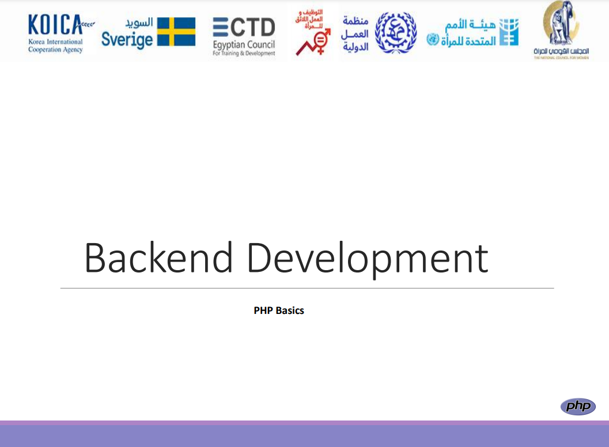

# Biz News Web Site

### Introduction:
This project is a project to create a website for publishing news. The initial code is using HTML, CSS, and JavaScript, and it will be developed and modified using the PHP language and linked to the MySQL database.

This project is the graduation project from the Pack-End Development program presented by**UN Women, the Egypt Council for Training and Development,** and other bodies.

The part of the admin page will be developed, through which users, news, and categories are reviewed, through which these news are categorized, and any of them can be added to or deleted by the user. The front interface will also be developed so that its data is displayed through databases Dynamicly.

